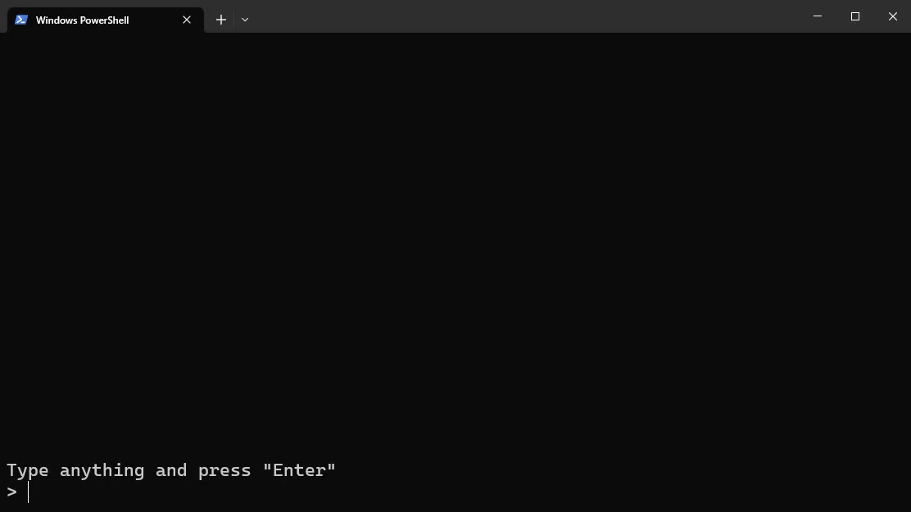

# Snap Console
*Easy-to-use interactive console for Python built on the curses library.*

-----

## Installation

You can install Snap Console with pip.

```
pip install snap-console
```

## Getting Started

Snap Console is built on top of the `curses` library to give you access to powerful console functionality without having to deal with low-level read/writes.

To begin, you can set up the console with the following code:

```py
from snapconsole import SnapConsole

console = SnapConsole()
console.start()
# Handle console commands here
console.stop()
```

`start()` initializes the empty console, and `stop()` resets the console to how it was before. You can also use Python’s context manager syntax to use the console:

```py
from snapconsole import SnapConsole

with SnapConsole() as console:
    # Handle console commands here
```

## The console

The console consists of 2 segments: the display and the input box. Logs are treated like lists, so basic list functions such as `append` and `pop` work on them.

```py
with SnapConsole() as console:
    console.logs.append('Hello world!')
    console.get_input() # Request user input to keep the console open until the user types "Enter"
```


List operations such as `+` and `*` work too. Refer to [Example 4](./examples/04-manipulate-logs.py) for more information.

## Alignment

By default, the textbox and logs are aligned to the bottom, but this can be changed in the params.

```py
from snapconsole import SnapConsole, TextboxAlignPosition, LogsAlignPosition

with SnapConsole(
    textbox_align_position=TextboxAlignPosition.TOP,
    logs_align_position=LogsAlignPosition.TOP,
) as console:
    console.logs.append('Logs 1')
    console.logs.append('Logs 2')
    console.logs.append('Logs 3')
    console.logs.append('Logs 4')
    console.logs.append('Logs 5')
    console.get_input()
```


If the textbox is aligned to the top and the logs are aligned to the bottom:


If the textbox is aligned to the bottom and logs are aligned to the top:


Refer to [Example 6](./examples/06-alignment.py).

## Styles

If you want to style your inputs, you can use the `curses`’ built-in styles and colors to render your output. Instead of appending a string, append an array with the style followed by the string.

```py
import curses

with SnapConsole() as console:
    console.logs.append([curses.A_UNDERLINE, 'Hello'])
    console.logs.append([curses.A_REVERSE | curses.A_ITALIC, 'World!'])
    console.get_input()
```


Refer to [Example 7](./examples/07-styles.py) for more examples of styles. Note that different consoles may render these styles differently, or might not even support them.

Colors are also supported.

```py
with SnapConsole() as console:
    # Initialize color
    color_index = 1
    curses.init_pair(color_index, curses.COLOR_RED, curses.COLOR_BLUE)

    console.logs.append([curses.color_pair(color_index), 'Hello world!'])
    console.get_input()
```


You can also append multiple styles in a single line by concatenating them in the array.

```py
with SnapConsole() as console:
    color_index = 1
    curses.init_pair(color_index, curses.COLOR_RED, curses.COLOR_BLUE)

    console.logs.append([
        curses.A_UNDERLINE, 'Hello',
        curses.A_NORMAL, ' ',
        curses.color_pair(color_index) | curses.A_REVERSE | curses.A_ITALIC, 'World!',
        curses.A_NORMAL, ' It’s a beautiful day!'
    ])
    console.get_input()
```


Refer to [Example 9](./examples/09-style-combinations.py) for more examples of styles.

## Async

Snap Console support async, allowing you to print new lines while the user can still type their inputs.

```py
import asyncio

async def console_counter_task(console):
    counter = 1
    while True:
        await asyncio.sleep(1)
        console.logs.append(f'Counter: {counter}')
        counter += 1

async def main():
    with SnapConsole() as console:
        counter_task = asyncio.create_task(console_counter_task(console))

        console.logs.append('Type anything and press "Enter"')

        # Loop using "async for" loop instead of "for"
        async for user_input in console:
            if len(user_input) == 0:
                break

            console.logs.append('ECHO: ' + user_input)

        counter_task.cancel()

asyncio.run(main())
```

